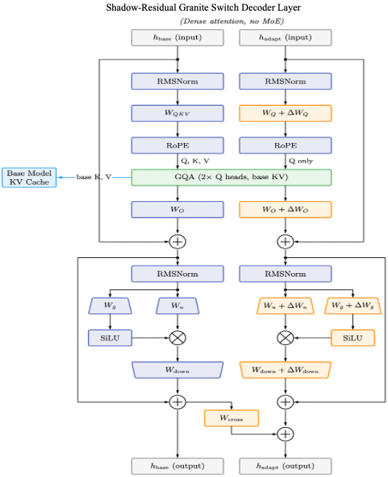

# Shadow Residual

Train and distribute **Shadow Residual (SR)** adapters for Granite models.

Shadow Residual is an alternate per-layer compute graph that runs **two parallel
hidden-state streams** through every decoder block:

- a **base stream** that is bit-exact with the unadapted base model (its Q/K/V/O
  and MLP are the frozen base weights — no adapter delta ever touches it), and
- an **adapter stream** that carries the trainable LoRA deltas plus a per-layer,
  rank-R **cross-stream injection** from the base.

There is no final merge gate: after the last layer the base stream is discarded
and only `norm(h_adapt)` reaches the LM head. The only base→adapter coupling is
the per-layer `h_adapt += cross_stream(h_base)` term — a low-rank channel that
lets the adapter re-import information the LoRA delta alone cannot express, while
keeping the base path exactly reproducible.

<p align="center">
  
</p>

**Why SR over per-token switched LoRA?**

- **Bit-exact base path** — serve non-adapter requests through the same model and
  get the base model's outputs, unchanged.
- **A per-layer base→adapter channel** (`cross_stream`) that is richer than a
  single LoRA delta.
- **Shared-base-KV mode** — the adapter attends over a K/V cache populated by the
  frozen base, so keys/values need not be recomputed when the adapter turns on.

For the full design walkthrough — module map, PEFT save/load, ALORA gating,
disjoint vs shared K/V, and the trainable-parameter inventory — see
[`docs/sr_architecture_explainer.md`](docs/sr_architecture_explainer.md).

## Install

The package installs with [`uv`](https://docs.astral.sh/uv/):

```bash
uv venv --python 3.12
uv pip install -e ".[train]"     # core + wandb; add [dev] for pytest
```

The core train/serve path is fully self-contained. The optional
`answerability_eval --mode switch/vllm` paths need the open-source
`granite-switch` package: `uv pip install -e ".[eval-switch]"` (or
`.[eval-vllm]`).

## Serving an SR adapter

An SR checkpoint is a standard PEFT adapter (`adapter_config.json` +
`adapter_model.safetensors`). Load the base + adapter through the SR loader — it
rebuilds the SR base and re-registers the SR custom PEFT modules, which
`PeftModel.from_pretrained` alone cannot do:

```python
import torch
from transformers import AutoTokenizer
from shadow_residual.peft_shadow_residual import load_shadow_residual_peft_model

BASE = "ibm-granite/granite-4.1-3b"
ADAPTER = "./checkpoints"            # local dir or HF repo id

tokenizer = AutoTokenizer.from_pretrained(ADAPTER, padding_side="left")
if tokenizer.pad_token is None:
    tokenizer.pad_token = tokenizer.eos_token

model = load_shadow_residual_peft_model(
    BASE, ADAPTER,
    torch_dtype=torch.bfloat16,
    shared_base_kv=True,            # MUST match how the adapter was trained
)
model.eval()

messages = [{"role": "user", "content": "Is the question answerable from the documents?"}]
inputs = tokenizer.apply_chat_template(
    messages, documents=[...], add_generation_prompt=True,
    return_tensors="pt", return_dict=True,
).to(model.device)

out = model.generate(**inputs, max_new_tokens=200, do_sample=False)
print(tokenizer.decode(out[0, inputs["input_ids"].shape[1]:], skip_special_tokens=True))
```

`shared_base_kv` is an architecture choice, not a LoRA hyperparameter, so it is
not stored in `adapter_config.json` — pass the same value used at training time.

## Training SR adapters

Training is driven by a single Pydantic-validated YAML (the schema does not name
architectures — behavior follows the fields you set). Reference configs live in
[`src/shadow_residual/config/`](src/shadow_residual/config/); `sr-*` configs
enable the dual-stream forward by listing `cross_stream` in `target_modules`.

### On the current server

Single GPU:

```bash
sr-train \
  --config src/shadow_residual/config/sr-qo-mlp-r32-c32-sharedkv.yaml \
  --train-data /data/train.jsonl \
  --val-data   /data/eval.jsonl \
  --output-dir ./checkpoints
```

Multi-GPU with `accelerate` (DDP; add `--config_file …/config/accelerate/fsdp_4gpu.yaml`
for FSDP at 8B/30B):

```bash
accelerate launch --num_processes 4 --multi_gpu --mixed_precision bf16 \
  -m shadow_residual.training.train \
  --config src/shadow_residual/config/sr-qo-mlp-r32-c32-sharedkv.yaml \
  --train-data /data/train.jsonl --val-data /data/eval.jsonl \
  --output-dir ./checkpoints
```

To train with the model's thinking/reasoning trace enabled, add `--thinking`
(or set `data.enable_thinking: true` in the YAML) — it is forwarded to
`apply_chat_template(enable_thinking=...)`:

```bash
sr-train --config <cfg>.yaml --train-data … --val-data … --thinking
```

Named CLI flags override matching YAML fields; see
[`src/shadow_residual/training/README.md`](src/shadow_residual/training/README.md)
for the full reference.

### On Vela

Vela is the OpenShift GPU cluster; jobs are AppWrappers wrapping PyTorchJobs,
rendered from Helm templates. Ready-to-fill job YAMLs are in
[`examples/vela/`](examples/vela/) (`lora.yaml`, `sr_sharedkv.yaml`, `sr_30b_FSDP.yaml`,
`vela1_ans_alora_all_linear_r16.yaml`). They clone this repo in-pod, `uv`/`pip`
install it, then `accelerate launch` the trainer against data on the mounted COS
PVC. Fill in the token placeholders (or reference a k8s Secret), then:

```bash
oc login --token=… --server=…            # cil15 LLM GPU account
helm template -f examples/vela/sr_sharedkv.yaml \
  --set-string "environmentVariables[0].value=$(date -u +%Y%m%dT%H%M%SZ)" \
  mlbatch/pytorchjob-generator | oc create -f -
oc logs -f -c pytorch <jobName>-master-0     # follow training
```

Notes carried over from real runs: pin `trl<1.7` (1.7 crashes on
`config.num_experts`), the Vela image ships torch 2.6 + CUDA 12.4, and
`eval_loss: nan` per epoch is expected for prompt-only eval rows (the
post-training generation is the real eval).

## Data preparation

Training data is JSONL, one chat conversation per row:

```json
{"messages": [ ...turns..., {"role": "assistant", "content": "<gold target>"}],
 "documents": [...], "tools": [...]}
```

- The **last message must be the assistant turn** — it is the supervised target.
  `tools` / `documents` (optional) are forwarded verbatim to
  `apply_chat_template`; the chat template renders them.
- **Eval rows** put gold in a separate `ground_truth` key (not a trailing
  message), so the prompt never leaks the answer.
- **Response-only loss**: the trainer masks everything before the final
  assistant turn — via TRL's `assistant_only_loss=True` when the chat template
  has `` tags, else via the built-in `ResponseOnlyCollator`
  (marker defaults to Granite's `<|start_of_role|>assistant<|end_of_role|>`,
  overridable with `data.assistant_marker`).

Helpers (see `shadow_residual.training`): `add_labels.py` stamps a `labels`
column from an activation sequence; `pack_stats.py` recommends a batch size for
padding-free packing. A 50-row synthetic sample lives at
`src/shadow_residual/training/data_samples/tiny_qa.jsonl`.

## Design decisions

- **Dual-stream, not switched.** Standard switching toggles one residual stream
  between base and adapter behavior per token. SR runs both streams
  unconditionally and reads only the adapter stream at the head — the base path
  stays reproducible, and the cross-stream term gives a per-layer base→adapter
  channel beyond the LoRA delta.
- **Two custom PEFT modules.** Stock PEFT can only wrap `nn.Linear` and always
  applies the delta. SR needs (1) `CrossStreamLora` to turn the weightless
  `cross_stream` site into a rank-R `B·A` projection, and (2) `ShadowResidualLora`
  to gate the LoRA delta off on `stream_context("base")` calls. Both are
  registered via `LoraConfig._register_custom_module`, so save is vanilla PEFT
  but load needs the dedicated `load_shadow_residual_peft_model`.
- **`merge_and_unload` is disabled.** Folding the delta into the base linear
  would contaminate the frozen-base path and break the whole invariant.
- **Disjoint vs shared base K/V.** The default keeps two disjoint K/V caches
  (base + adapter). `shared_base_kv=True` (the production variant) computes K/V
  once from the base stream and lets the adapter's Q attend it — one cache,
  adapter-independent — and forbids K/V LoRA (no place for the delta to land).
- **Unfused projections.** SR uses per-projection Q/K/V and gate/up so a separate
  LoRA can attach to each. This changes the reduction order vs. upstream Granite's
  fused kernels, so SR is *equivalent* but not bit-identical to a stock
  base+LoRA — a documented, negligible drift for greedy decoding.
- **Self-contained packaging.** The model's config is vendored as
  `ShadowResidualConfig` (a thin `GraniteMoeHybridConfig` subclass), so the core
  train/serve path has no dependency on the granite-switch submodule.

## Tests

```bash
uv pip install -e ".[dev]"
pytest                       # CPU-only; GPU/model-marked cases skip locally
```

The suite pins the load-bearing invariants: dual-stream forward shapes, the two
disjoint K/V caches, and the ALORA pre-invocation logits/KV equality that make
the frozen-base guarantee real.

## License

Apache-2.0. See [LICENSE](LICENSE).
